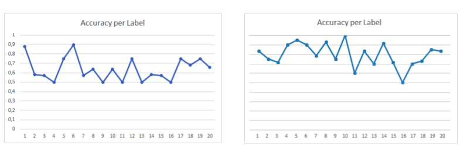

## Contents

1. [Motivation](#motivation)
2. [Goal and scope](#goal-and-scope)
3. [Tools and Models](#tools-and-models)
	- [LanguageTool](#languagetool)
	- [GECToR](#gector)
	- [Fine-tuning and Datasets](#fine-tuning-and-datasets)
4. [Implementation](#implementation)
	- [Grammatical Error Detection Pipeline](#grammatical-error-detection-pipeline)
	- [Grammar Feedback and Passing the Task](#grammar-feedback-and-passing-the-task)
5. [Outlook and Limitations](#outlook-and-limitations)
6. [References](#references)

## Motivation

Learning to correctly apply grammatical structures in written language is an important and often difficult task for English learners. Therefore, during this semester, grammatical error correction (GEC) was introduced in Escapeling in order to help learners improve their grammar skills. More specifically, state-of-the-art [NLP-tools for GEC](#tools-and-models) were employed in the [discussion task](link).

The discussion task offers a suitable framework for actively learning and practicing grammar because in this task, users actively produce language, as opposed to focusing on language comprehension in [other tasks](link). To that end, we include diverse feedback on the users’ contributions both after each round of the discussion and at the end of the task.

Another reason for adding GEC to the discussion task is the improvement of the completion metric for this task. That is, in line with the [escape-room](link to storytelling) framing of the app, users’ performance is linked to getting pieces of the code in order to complete the mission. Previously, the performance was only evaluated quantitatively, i.e., by setting a threshold on the minimal number of words users need to produce in order to pass the task. We deem that adding a qualitative evaluation of the contributions to the completion metric improves the accuracy and is advantageous from a learning experience perspective. Therefore, we integrate a score computed via our GEC tools into the updated [completion metric](Implementation) of the discussion task. Finally, our integration of GEC tools can potentially be of use in other parts of the app in the future.

Below, details can be found on how we operationalize GEC in order to improve the learning experience offered to our users in the discussion task. 

## Goal and Scope


## Tools and Models

### LanguageTool

The first tool we tested and evaluated for our task is the python library `language_tool_python` (https://pypi.org/project/language-tool-python/) which is a Python wrapper for LanguageTool. LanguageTool (LT) is an open-source spelling and grammar checker used in OpenOffice (see the project home page at https://languagetool.org for more information and source code). It was originally developed by Daniel Naber during his diploma work and is currently maintained by him and an open source community (Naber, 2003). 

LT is a rule-based model which allows to detect grammar errors and spelling mistakes. The Python library makes it accessible through a Python script or through a command-line interface. The `language_tool_python` library can either be used by running a local server in the background (this is the default setting which requires Java 8.0 and 200MB) or alternatively via the API. We decided to use the default settings and run a local server in order to make our application more independent from other services. 

The following shows how to instantiate and use the tool:

``` 
import language_tool_python
tool = language_tool_python.LanguageTool('en-US')
```

The check function returns a list of Match objects which contain the Error ID of the violated grammatical rule, a message explaining the correction, and a suggestion for a correction. 
For example: 

```
text = 'A sentence with an error in the Hitchhiker’s Guide tot he Galaxy'
matches = tool.check(text)
print(matches[1])

>>> Line 1, column 51, Rule ID: TOT_HE[1]
>>> Message: Did you mean 'to the'?
>>> Suggestion: to the
```

The tool can also be used to automatically correct input sentences: 

```
tool.correct(text)
>>> 'A sentence with an error in the Hitchhiker’s Guide to the Galaxy'
```

However, as we tested this feature, we concluded that it can oftentimes be misleading to English learners and propose corrections which do not match the intended message the user wanted to write. Thus, we only use LT to identify errors and track which errors have been made repeatedly. To this end, we identified a set of 20 grammatical error types which we assume new English learners at our target proficiency level will likely make and which we are also fairly certain that LT will detect (see our dataset with examples for each of these errors [here](https://docs.google.com/spreadsheets/d/1RG3Hkb59h8DgtXzJnkh9fbOq3yHjRm2AN00qlpnhlUs/edit#gid=1946205687)). 
To assure this, we ran an evaluation script and tested the tool on three datasets (see [Fine-tuning and datasets](Fine-tuning and datasets)). 

### GECToR

We decided to chain two models and additionally use a neural transformer-based model GECToR, an open-source pretrained model published by grammarly (Omelianchuk et al., 2020), because LT was quite reliable at catching certain types of errors, but missed other kinds of errors, resulting in a lower accuracy.

The model consists of a transformer-based sequence tagging encoder with two linear layers on top (Vaswani et al., 2017). The encoder applies error corrections by making token-level transformations of the erroneous input text. To this end, the training data was tagged with transformations minimizing the Levenshtein distance between input and target sequences. The encoder was pretrained on several datasets and is [available on GitHub](https://github.com/grammarly/gector). The linear layers perform error detection and error tagging. Based on our testing results, we chose to use the pretrained RoBERTa backbone for the encoder (Omelianchuk et al., 2020). When using available inference scripts, the model outputs a suggested correct sentence, given an input sentence. That is, off-the-shelf GECToR is not ideal for identifying the types of errors made by users because no error IDs are available. Using the model requires storing the frozen checkpoints (~500MB) and performing inference via a local API (~3GB).

### Fine-tuning and Datasets

Due to open-source availability and computational cost considerations, LT and GECToR remained as the two final candidate tools for our use case, among different approaches to GEC proposed by the NLP community (e.g., Ng et al., 2014) . 

To assess their accuracy, we evaluated both tools on several datasets. While aiming for high accuracy, we also deem a low False Positive rate of identified errors particularly important because indicating errors to learners that are in fact not present would be counterproductive for both their learning progress and the user experience. Thus, we prioritized a low False Positive rate over a low False Negative rate. 

The first evaluation step was performed using a corpus constructed from the first training data split from the WI+LOCNESS BEA 2019 corpus (Bryant et al., 2019). That corpus was initially chosen because it consists of sentences (N = 1300) from essays written by English learners close to our target proficiency level. Then, sentences containing our target grammatical structures (see above) were extracted (N = 320). The initial evaluation on this dataset indicated that LT has a lower accuracy than GECToR but also a lower False Positive rate. However, it became clear that it is difficult to assess the performance of the tools with respect to the important error types on this data because most sentences contained several hard-to-disentangle errors. Therefore, we evaluated the tools on two further datasets. 

We used the dataset created for the [sentence correction task](link) specifically to assess the False Positive rate of the tools since a hand-checked ground truth was given for these sentences. The results of this evaluation can be seen below:

**LanguageTool:**    

Classification  |  Counts
:-------------  |  :----------: |
True Positives  |  768
True Negatives  |  1468
False Positives |  33
False Negatives |  733

Accuracy: 0.745  
FPR: 0.022

**GECToR:**

Classification  |  Counts
:-------------  |  :----------: |
True Positives  |  1065
True Negatives  |  1414
False Positives |  95
False Negatives |  444
  
Accuracy: 0.821  
FPR: 0.063

Given the close match in performance of LT and GECToR, we decided to hand-craft a third dataset containing 5-10 examples per error type that we identified (see above). The dataset consists of 237 sentences with 20 different error codes (see our [custom dataset](https://docs.google.com/spreadsheets/d/1RG3Hkb59h8DgtXzJnkh9fbOq3yHjRm2AN00qlpnhlUs/edit?usp=sharing) )



Given the performance on this final dataset, we decided to use both models and chain them for inference. 

In order to focus on error types that we deem more relevant for our target learners, we fine-tuned LT by excluding certain identified error categories: style, typography, redundancy and casing. These error categories are rather related to high-level proficiency than to grammatical skills. Further fine-tuning of LT was outside of the scope of this feature because it would require constructing additional rules for the knowledge base of the tool.

To further decrease the False Positive rate introduced by GECToR, the last two layers of the model were fine-tuned on a synthetic dataset generated in a rule-based fashion from the hand-crafted dataset. The augmented dataset contained 800 sentences. The model was trained on a 98/2 train/validation split for 20 epochs, 10000 steps/epoch, with a learning rate 0.01. This allowed to decrease the False Positive rate of the model as measured on the sentence correction dataset to 0.036. 

In sum, given our evaluation, we decided to take on the challenge of using the advantages of both models, while balancing out their respective disadvantages. 

## Implementation

### Grammatical Error Detection Pipeline

In this section, we will discuss how the task of detecting grammatical errors in user input sentences was implemented. The pipeline consists of four steps: input preprocessing, error classification, correctness score calculation, and user participation scoring.

While emojis and text formatting (such as italicizing a given word) arguably carry meaning, they are of no consequence regarding the grammaticality of a message. We therefore strip the message of emojis and rich text formatting before processing them further. In addition to that, we automatically capitalize the first letter of a message. This is because GECToR considers a sentence as being incorrect if it does not begin capitalized. We do not expect users to be unaware that the first token of a sentence should be capitalized; instances of lowercase sentence starts can likely be attributed to the style in which people text. That is not something we want to penalize. Finally, we exclude messages that do not contain any text elements such as images or gifs.

The preprocessed messages are then evaluated by the GrammarClassifier (GC) object in `grammar_classifier.py`. This object chains the GECToR model and the LT instance. We decided to chain two models to reduce the number of False Positives in detecting errors, even at the risk of increasing the rate of False Negatives. The GC calculates a correctness score, encoding how confident it is that a given sentence is incorrect, and provides a list of error types that were found in that sentence.
The correctness score is calculated based on the separate model outputs. The base value of the correctness score is 1; this represents a correct sentence. If both GECToR and LT classify the sentence as incorrect, the correctness score is set to 0. If either model classifies the sentence as correct while the other classifies it as incorrect, the correctness score is set to 0.5. Furthermore, we have identified a subset of grammatical rule violations that are particularly prevalent in language learners’ texts (such as using the indefinite article “a” when an “an” would be correct or vice versa) that LT can identify with high accuracy. If it identifies one of these errors in a sentence, the correctness score is set to 0, ignoring the GECToR output.

Based on the correctness score, an individual user score is calculated for each user’s participation in each discussion question. This score is the product of total sentence length and the correctness score. Only sentences longer than two words are considered for this, as shorter sentences should not make up a participant’s entire contribution to the discussion; moreover, grammatical error correction simply works more accurately on longer sequences. In addition to a user score, a group score is also calculated. This score serves to rate the group’s performance in the discussion task. We compute the mean score per task for each user. The mean of all users’ scores constitutes the group score.

### Grammar Feedback and Passing the Task 

We modified the existing conversation handler in `discussion_handler.py` , `discussion.py`, and `handler/__init__.py` . We removed the evaluation questionnaire at the end of the task, which was formerly used as a basis for scoring the task, and included intermediate and final feedback based on the individual user score and group score. 

After the first and second discussion round, an intermediate feedback is sent by the bot, which aims at motivating the users and providing a first assessment of the group performance thus far. The intermediate feedback takes into account the quantity and quality of user contributions. 

For the quantitative aspect, it is evaluated if every user took part in the discussion based on the individual user participation, which is the total number of words written in this round of discussion. If not every user has met a certain threshold, the bot will send a message to encourage the group to write more in the next round. This threshold is currently set to 15 words per user, but should be fine-tuned and adapted after further testing and evaluation. 

For the qualitative aspect of the feedback, it is checked if the users made many grammatical mistakes in relation to the amount they contributed. It is evaluated whether each user reached a minimum ratio of correct sentences, which is calculated as the quotient between the user score and user participation. If not every user has met a certain ratio, they will be advised to pay more attention to writing correct sentences. This threshold is currently set to 0.5 but should be fine-tuned and adapted after further testing and evaluation. 


At the end of the discussion, a final feedback is sent to the group. The final feedback informs the users which error was most often identified during the discussion (if there were any). It also provides the respective grammatical rule and suggests how to avoid this error in the future. Only common errors which LT can reliably detect are considered here, as we use the error ID provided by the tool to track the number of errors. For each of these common errors, we included a specific feedback message. To ensure that we do not provide feedback for an error which was actually a misclassification (False Positive), the feedback is only sent if the error was detected at least 3 times throughout the discussion. 


The group passes the task if they meet two requirements. First, each user has to reach a minimum user score in at least two of the three discussion rounds, which is currently set to 5. The second condition is that the group reaches a group threshold together, which is divided into three different levels. The group passes the task at an intermediate level if the score is 5-10; at a good level if the score is 10-15; and at a very good level if the score is at least 15. These conditions are checked in the `is_correct` function in `discussion.py`. The function returns the group level which aligns with the newly developed [storytelling features](storytelling) which requires each task to provide one failure and three possible pass stages. 

## Outlook and Limitations

While this implementation of grammatical error detection works well for our purpose, there are still things that need to be improved. Two issues in particular should be addressed in the future to improve the usefulness of the tool.

In its current implementation, the tool only evaluates original messages from users. Telegram offers post-hoc editing functionality. Therefore, users could fix typos and similar issues they notice themselves after having sent the message. These edits and corrections are currently not taken into consideration. However, this issue is a more general problem of Telegram Message Handlers and out of scope for our task.

Correctness scoring is also currently flawed. First, using non-words or neologisms does not automatically result in a correctness score of 0. Improving scoring to more confidently punish entirely incorrect sentences will be a more crucial component once the game targets an audience with a higher English skill level. Second, some non-English names are considered typos and result in a correctness score of 0.5 rather than 1, even when the entire sentence is technically correct.

Overall, we improved the evaluation of the discussion task and added automatic GEC to the bot. The grammatical feedback provided to the users is hopefully a valuable support to their learning experience.

## References

Bryant, C., Felice, M., Andersen., Ø. E., and Briscoe, T. (2019). The BEA-2019 Shared Task on Grammatical Error Correction. In Proceedings of the 14th Workshop on Innovative Use of NLP for Building Educational Applications, Florence, Italy. Association for Computational Linguistics.

Naber, D. (2003). A rule-based style and grammar checker (Diplomarbeit, Universität Bielefeld). http://citeseerx.ist.psu.edu/viewdoc/download?doi=10.1.1.148.6882&rep=rep1&type=pdf

Ng, H. T., Wu, S. M., Briscoe, T., Hadiwinoto, C., Susanto, R. H., & Bryant, C. (2014). The CoNLL-2014 shared task on grammatical error correction. In Proceedings of the Eighteenth Conference on Computational Natural Language Learning: Shared Task (pp. 1-14).

Omelianchuk, K., Atrasevych, V., Chernodub, A. and Skurzhanskyi, O. (2020) GECToR - Grammatical Error Correction: Tag, Not Rewrite. In Proceedings of the Fifteenth Workshop on Innovative Use of NLP for Building Educational Applications (pp. 163-170)

Vaswani, A., Shazeer, N., Parmar, N., Uszkoreit, J., Jones, L., Gomez, A. N., ... & Polosukhin, I. (2017). Attention is all you need. In Advances in neural information processing systems (pp. 5998-6008).
